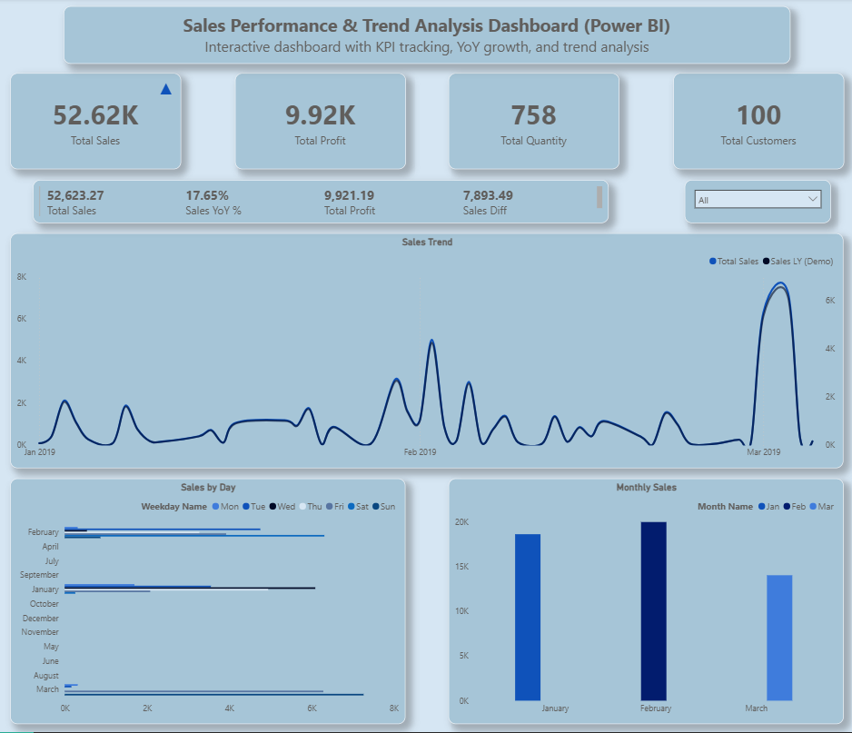
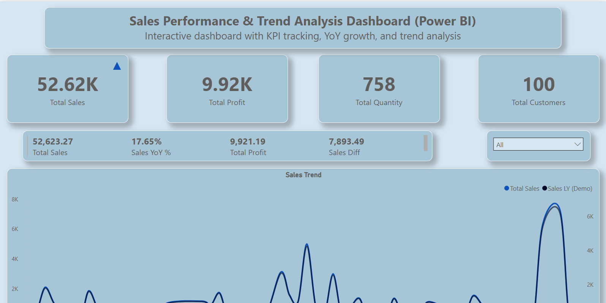

# Sales Performance & Trend Analysis Dashboard (Power BI) 📊 

## Project Overview
This project presents an interactive sales performance analysis dashboard built using Power BI to evaluate business performance through key KPIs, time-based trends, and comparative analysis.
The dashboard focuses on sales growth, profitability, customer metrics, and trend indicators, enabling business users to quickly interpret performance patterns and support data-driven decision-making.

This project demonstrates practical skills in data modeling, DAX time intelligence, and dashboard design.

---

## Key Objectives
- Monitor overall Sales, Profit, Quantity, and Customers
- Analyze monthly sales trends
- Measure Year-over-Year (YoY) growth
- Track MTD, QTD, and YTD performance
- Enable interactive analysis using date hierarchy slicers

---

## Dataset Information
The dataset represents retail sales transactions and includes attributes such as:

- Order Date
- Sales
- Profit
- Quantity
- Customer ID
- Region
- Segment
- Category & Sub-Category

A separate Date Table was created to support time-based analysis.

---

## Tools & Technologies
- **Power BI Desktop**
- **DAX** (Data Analysis Expressions)
- **Data Modeling**
- **Date Table & Time Intelligence**
- **Interactive Visualizations**

---

## Data Model & Relationships
- Fact Table: Sales transaction data
- Date Dimension:  Dedicated Date table with Year, Quarter, Month, and Weekday fields
- Relationship:  DateTable[Date] → Sales[Order Date] (One-to-Many)

This structure ensures accurate and scalable time intelligence calculations.

---

## Analysis Workflow
The project follows a structured analytics approach:
1. **Data loading and Inspection**
2. **Data Modeling and Relationship creation**
3. **Date Table creation and Hierarchy setup**
4. **DAX Measure development**
5. **KPI and Trend Visualization**
6. **Insight Generation**

---

## Key KPIs & Metrics
- Total Sales
- Total Profit
- Total Quantity
- Total Customers
- Sales YoY %
- Sales Difference vs Last Year
- Trend indicators (▲ / ▼ arrows)

---

## DAX Highlights
- Total Sales = SUM ( Sheet1[Sales] )
- Total Profit = SUM ( Sheet1[Profit] )
- Total Quantity = SUM ( Sheet1[Quantity] )
- Total Customers = DISTINCTCOUNT ( Sheet1[Customer ID] )
- Sales LY = [Total Sales] * 0.85
- Sales Diff = [Total Sales] - [Sales LY]
- Sales YoY % = DIVIDE ( [Sales Diff], [Sales LY] )
- Sales MTD = TOTALMTD ( [Total Sales], DateTable[Date] )
- Sales QTD = TOTALQTD ( [Total Sales], DateTable[Date] )
- Sales YTD = TOTALYTD ( [Total Sales], DateTable[Date] )

---

## Dashboard Features
- KPI cards with trend indicators
- Monthly sales trend analysis
- Weekday-based sales breakdown
- Interactive month hierarchy slicer
- Clean, executive-friendly layout

---

## Dashboard Screenshots

### Executive Overview

### KPI Section

### Sales Trend Analysis

---

## Key Insights
This dashboard helps uncover:

- High and low performing months

- Sales momentum compared to last year

- Seasonal and weekday trends

- Customer contribution patterns

These insights support sales planning, performance monitoring, and business strategy.

---

## Project Structure

📁 Sales-Performance-PowerBI-Dashboard
     
┣ 📄 Sales_Performance_Dashboard.pbix

┣ 📄 README.md

┣ 📄 screenshots/

## How to Use:
1. Download the .pbix file
2. Open it in **Power BI Desktop**
3. Use slicers to filter by **Month**
4. Explore KPIs and trends interactively

---

## Highlight
**Sales Performance & Trend Analysis | Power BI, DAX, Data Visualization**

- Designed an interactive Power BI dashboard for sales performance tracking
- Implemented YoY, MTD, QTD, and YTD analysis using DAX
- Built a date hierarchy slicer for dynamic time-based insights
- Applied clean UI/UX principles for executive reporting

---

## Author
**Aryan Masih**  
Data Analytics Portfolio Project | Power BI Case Study

